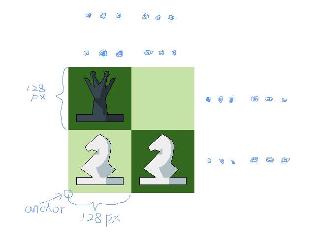

+++
title = "Chess ONE"
date = 2024-04-20
updated = 2024-08-07
description = "Let's learn game development with Chess as our first lesson!"
taxonomies = { tags = ["learning", "practice"] }
+++

> **🤖 AI Translation Notice**: This post has been translated from Chinese to English by an AI.

# Why Chess?

Everything is hard at the beginning. As a complete beginner, I was at a loss facing Bevy and ECS. I needed a practice project to get my feet wet. Compared to jumping straight into a big project, starting small is much more realistic — perhaps this is exactly why my efficiency has been so low (as of April 2024). Chess is a good choice. Let's start by creating a GitHub repository: [chess](https://github.com/DeadPoetSpoon/chess.git).

# This Article Is Based On

[chess v0.2.0](https://github.com/DeadPoetSpoon/chess/tree/v0.2.0)

# Creating the Project

Following the [official tutorial](https://bevyengine.org/learn/quick-start/getting-started/setup/)

Create a Rust project:
```bash
cargo new chess
cd chess
```

Add the Bevy dependency:
```bash
cargo add bevy
```

Complete the necessary configurations from the tutorial:
- [Compile with Performance Optimizations](https://bevyengine.org/learn/quick-start/getting-started/setup/#compile-with-performance-optimizations)
- [Enable Fast Compiles (Optional)](https://bevyengine.org/learn/quick-start/getting-started/setup/#enable-fast-compiles-optional)
- [Improve Runtime Performance (Optional)](https://bevyengine.org/learn/quick-start/getting-started/setup/#improve-runtime-performance-optional)

Now let's get to the real work!

# Turning the Game into a Plugin

> One of Bevy's core principles is modularity. All Bevy engine features are implemented as plugins—collections of code that modify an App. This includes internal features like the renderer, but games themselves are also implemented as plugins! This empowers developers to pick and choose which features they want. Don't need a UI? Don't register the UiPlugin. Want to build a headless server? Don't register the RenderPlugin. -- [Bevy](https://bevyengine.org/learn/quick-start/getting-started/plugins/)

Following the official recommendation, Bevy treats everything as a plugin. Let's organize our game as a plugin too!

Create the `chess` folder and `mod.rs` file:

```rust
pub struct ChessPlugin {}

impl Plugin for ChessPlugin {
    fn build(&self, app: &mut bevy::prelude::App) {
    }
}
```

Modify `main.rs` to import our chess module and add it to the App's plugins:

```rust
mod chess;

fn main() {
    App::new()
        .add_plugins(DefaultPlugins.set(bevy::log::LogPlugin::default()))
        .add_plugins(ChessPlugin {})
        .run();
}
```

# Thinking About the Most Basic ECS for Chess

> All app logic in Bevy uses the Entity Component System paradigm, which is often shortened to ECS. ECS is a software pattern that involves breaking your program up into Entities, Components, and Systems. Entities are unique "things" that are assigned groups of Components, which are then processed using Systems. -- [Bevy](https://bevyengine.org/learn/quick-start/getting-started/ecs/)

## Entities

- Pieces (PiecesEntity): What we play with
- Board (BoardEntity): Where we play

## Components

- Pieces: The component for piece entities
- Board: The component for board entities
- ChessColor: A chess world with only black and white
- Position: The position of pieces and the board
- Theme: Dressing up the pieces and board
- Description: Leave some notes and help text

## Systems

- Mouse event listener system (move_mouse_events_system): Listens for mouse click events
- Startup system (startup_system): Initializes the game state, creates the board, etc.
- Piece position initialization system (create_pieces_system): Generates pieces at default positions
- Board rendering system (show_board_system): Renders the board
- Piece rendering system (show_pieces_system): Renders the pieces
- Piece selection system (select_pieces_system): Selects pieces
- Piece movement system (move_pieces_system): Moves pieces

## Resources

- Current game state (GameState)

## Assets

- Piece initial positions and basic information (PiecesInfos)
- Game settings (GameSetting)

# Let's Implement Them

## Creating Entities and Components

Create `component.rs` and `entity.rs` files, and add declarations in `mod.rs`:

```rust
mod component;
mod entity;
```

### Pieces and Board

Both need to be distinguished by their respective components:

```rust
// Piece entity
// Add Bundle and Default derive macros
#[derive(Bundle, Default)]
pub struct PiecesEntity {
    pub pieces: Pieces,
}

// Board entity
// Add Bundle and Default derive macros
#[derive(Bundle, Default)]
pub struct BoardEntity {
    pub board: Board,
}
```

Both need common components necessary for gameplay, which we need to implement ourselves:

```rust
// Represents the color of a piece or board
pub color: ChessColor,
// Represents description info of a piece or board
pub des: Description,
// Represents the position of a piece or board
pub position: Position,
// Represents the skin of a piece or board
pub theme: Theme,
```

They also need basic rendering components, which are existing Bevy components — essentially [SpriteBundle](https://docs.rs/bevy/latest/bevy/sprite/struct.SpriteBundle.html):

```rust
// Set sprite rendering properties
pub sprite: Sprite,
// Transform relative to parent
pub transform: Transform,
// Absolute transform
pub global_transform: GlobalTransform,
// A reference-counted "pointer" to the image asset to render
pub texture: Handle<Image>,
// Controls whether to render
pub visibility: Visibility,
// Inherited visibility
pub inherited_visibility: InheritedVisibility,
// View visibility
pub view_visibility: ViewVisibility,
```

Final `entity.rs`: <https://github.com/DeadPoetSpoon/chess/blob/v0.2.0/src/chess/entity.rs>

### Components

#### Adding `serde`

Since some component structs need to support deserialization from files, add the `serde` dependency:
```bash
cargo add serde --features serde_derive
```

#### Description

```rust
// Add default implementation
#[derive(Component, Default, Clone, Serialize, Deserialize)]
pub struct Description {
    // Name
    pub name: String,
    // Description
    pub des: String,
    // Help
    pub help: String,
}
```

#### Color

We need a `struct` as a component and an `enum` to represent colors:

```rust
// Add default implementation
#[derive(Default, Debug, Clone, Serialize, Deserialize, PartialEq)]
pub enum ChessColorKind {
    // White
    #[default]
    White,
    // Black
    Black,
    // Gray: pieces that have been "captured"
    Gray,
}

// Implement `Display`
impl Display for ChessColorKind {
    fn fmt(&self, f: &mut std::fmt::Formatter<'_>) -> std::fmt::Result {
        match self {
            ChessColorKind::White => f.write_str("white"),
            ChessColorKind::Black => f.write_str("black"),
            ChessColorKind::Gray => f.write_str("gray"),
        }
    }
}

// Add default implementation
#[derive(Component, Default)]
pub struct ChessColor {
    // Color
    pub kind: ChessColorKind,
}
```

#### Position

The positions of pieces and the board can only be within an 8×8 grid, so we use `u8` to store them:

```rust
// Add default implementation
#[derive(Component, Default, Debug, PartialEq, Clone)]
pub struct Position {
    // Row [0,7]
    pub row: u8,
    // Column [0,7]
    pub col: u8,
}
```

#### Theme

Essentially using images from different folders:

```rust
// Add default implementation
#[derive(Component, Default)]
pub struct Theme {
    // Image path
    pub asset_father_path: String,
}
```

#### Pieces

Contains the piece type enum and its selected state:

```rust
// Add default implementation
#[derive(Default, Debug, Clone, Serialize, Deserialize)]
pub enum PiecesKind {
    #[default]
    King,
    Queen,
    Rook,
    Knight,
    Bishop,
    Pawn,
}

// Implement Display
impl Display for PiecesKind {
    fn fmt(&self, f: &mut std::fmt::Formatter<'_>) -> std::fmt::Result {
        match self {
            PiecesKind::King => f.write_str("king"),
            PiecesKind::Queen => f.write_str("queen"),
            PiecesKind::Rook => f.write_str("rook"),
            PiecesKind::Knight => f.write_str("knight"),
            PiecesKind::Bishop => f.write_str("bishop"),
            PiecesKind::Pawn => f.write_str("pawn"),
        }
    }
}

// Add default implementation
#[derive(Component, Default, Debug)]
pub struct Pieces {
    // Piece type
    pub kind: PiecesKind,
    // Whether it is selected
    pub selected: bool,
}
```

#### Board

The board currently has nothing:

```rust
// Add default implementation
#[derive(Component, Default)]
pub struct Board {}
```

#### Complete

Final `component.rs`: <https://github.com/DeadPoetSpoon/chess/blob/v0.2.0/src/chess/component.rs>

## Creating Resources

Create `resource.rs` and add the declaration in `mod.rs`:

```rust
mod resource;
```

The only resource currently is the game state.

First, we need to record the current turn color, selected piece, and target position:

```rust
#[derive(Resource, Default, Debug)]
pub struct GameState {
    // Record the selected position
    pub selected_position: Option<Position>,
    // Record the target position to move to
    pub move_position: Option<Position>,
    // Current turn color
    pub current_turn: ChessColorKind,
}
```

Also need to add control for game settings and piece initial position assets:

```rust
// Game settings
pub game_setting_handle: Handle<GameSetting>,
pub game_setting_has_load: bool,
// Piece initial positions and basic info
pub pieces_infos_handle: Handle<PiecesInfos>,
pub pieces_infos_has_load: bool,
```

Final `resource.rs`: <https://github.com/DeadPoetSpoon/chess/blob/v0.2.0/src/chess/resource.rs>

## Creating Assets

Create `asset.rs` and add the declaration in `mod.rs`:

```rust
mod asset;
```

### Handling Asset Loading Errors

Following the [official tutorial](https://github.com/bevyengine/bevy/blob/main/examples/asset/custom_asset.rs) for loading custom assets, first handle the errors:

```rust
#[derive(Debug, Error)]
pub enum AssetLoaderError {
    #[error(transparent)]
    Io(#[from] std::io::Error),
    #[error(transparent)]
    RonError(#[from] ron::error::Error),
    #[error(transparent)]
    RonSpannedError(#[from] ron::error::SpannedError),
    #[error(transparent)]
    LoadDirectError(#[from] bevy::asset::LoadDirectError),
}
```

### Game Settings
Currently empty:

```rust
#[derive(Asset, TypePath, Default, Serialize, Deserialize)]
pub struct GameSetting {}
```

Implement a custom asset loader with the extension set to `setting.ron`:

```rust
#[derive(Default)]
pub struct GameSettingLoader;

impl AssetLoader for GameSettingLoader {
    type Asset = GameSetting;
    type Settings = ();
    type Error = AssetLoaderError;

    fn load<'a>(
        &'a self,
        reader: &'a mut Reader,
        _settings: &'a Self::Settings,
        _load_context: &'a mut LoadContext,
    ) -> BoxedFuture<'a, Result<Self::Asset, Self::Error>> {
        Box::pin(async move {
            let mut bytes = Vec::new();
            reader.read_to_end(&mut bytes).await?;
            let ron = ron::de::from_bytes(&bytes)?;
            Ok(ron)
        })
    }
    fn extensions(&self) -> &[&str] {
        &["setting.ron"]
    }
}
```

### Piece Initial Positions and Basic Information

Load each piece's initial position, description info, etc. We need a list to store all piece information:

```rust
#[derive(Asset, TypePath, Default, Serialize, Deserialize)]
pub struct PiecesInfos {
    pub pieces_info_vec: Vec<PiecesInfo>,
}

#[derive(Default, Serialize, Deserialize)]
pub struct PiecesInfo {
    pub des: Description,
    pub color: ChessColorKind,
    pub kind: PiecesKind,
    pub row: u8,
    pub col: u8,
    pub theme: String,
}
```

Implement a custom asset loader with the extension set to `pieces.ron`:

```rust
#[derive(Default)]
pub struct PiecesInfosLoader;

impl AssetLoader for PiecesInfosLoader {
    type Asset = PiecesInfos;
    type Settings = ();
    type Error = AssetLoaderError;

    fn load<'a>(
        &'a self,
        reader: &'a mut Reader,
        _settings: &'a Self::Settings,
        _load_context: &'a mut LoadContext,
    ) -> BoxedFuture<'a, Result<Self::Asset, Self::Error>> {
        Box::pin(async move {
            let mut bytes = Vec::new();
            reader.read_to_end(&mut bytes).await?;
            let ron = ron::de::from_bytes(&bytes)?;
            Ok(ron)
        })
    }

    fn extensions(&self) -> &[&str] {
        &["pieces.ron"]
    }
}
```

### Complete

Final `asset.rs`: <https://github.com/DeadPoetSpoon/chess/blob/v0.2.0/src/chess/asset.rs>

Default piece info `default.pieces.ron`: <https://github.com/DeadPoetSpoon/chess/blob/v0.2.0/assets/default.pieces.ron>

## Systems

Finally we reach the systems part. Let's think about "how to play chess!"

Create `event.rs` and `system.rs`, and add declarations in `mod.rs`:

```rust
mod event;
mod system;
```

### Events

The action of playing chess can be broken down into two steps: selecting the piece to move and selecting the position to move to. We can use the left and right mouse buttons to implement this.

When left-clicking, record the clicked board position and mark it as the selected piece; when right-clicking, record the clicked board position and mark it as the target position.

Refer to the [official tutorial](https://github.com/bevyengine/bevy/blob/main/examples/input/mouse_input.rs):

```rust
pub fn move_mouse_events_system(
    mouse_button_input: Res<ButtonInput<MouseButton>>,
    window: Query<&Window, With<PrimaryWindow>>,
    camera: Query<(&Camera, &GlobalTransform)>,
    mut game_state: ResMut<GameState>,
) {
    // On left click
    if mouse_button_input.just_released(MouseButton::Left) {
        // Get current window
        if let Some(window) = window.iter().next() {
            // Get mouse position
            if let Some(mouse_position) = window.cursor_position() {
                // Get camera transform params
                let (camera, camera_transform) = camera.single();
                if let Some(mouse_position) =
                    // Convert mouse click position to world coordinates
                    camera.viewport_to_world_2d(camera_transform, mouse_position)
                {
                    // Calculate board coordinates
                    let row = (mouse_position.y as i32 / 128) as u8;
                    let col = (mouse_position.x as i32 / 128) as u8;
                    // Save selected position to game state
                    if game_state.selected_position.is_none() {
                        game_state.selected_position = Some(Position { row, col });
                    } else {
                        let position = game_state.selected_position.as_mut().unwrap();
                        position.col = col;
                        position.row = row;
                    }
                }
            }
        }
    }

    if mouse_button_input.just_released(MouseButton::Right) {
        if let Some(window) = window.iter().next() {
            if let Some(mouse_position) = window.cursor_position() {
                let (camera, camera_transform) = camera.single();
                if let Some(mouse_position) =
                    camera.viewport_to_world_2d(camera_transform, mouse_position)
                {
                    let row = (mouse_position.y as i32 / 128) as u8;
                    let col = (mouse_position.x as i32 / 128) as u8;
                    // Save selected move position to game state
                    if game_state.move_position.is_none() {
                        game_state.move_position = Some(Position { row, col })
                    } else {
                        let position = game_state.move_position.as_mut().unwrap();
                        position.col = col;
                        position.row = row;
                    }
                }
            }
        }
    }
}
```

Final `event.rs`: <https://github.com/DeadPoetSpoon/chess/blob/v0.2.0/src/chess/event.rs>

### Startup System

This system initializes the 2D camera, game state, and board:

```rust
pub fn startup_system(
    mut commands: Commands,
    mut game_state: ResMut<GameState>,
    assets: Res<AssetServer>,
) {
    // Create camera
    commands.spawn(Camera2dBundle {
        // Base camera position
        transform: Transform::from_translation(Vec3 {
            x: 450.0,
            y: 450.0,
            z: 0.0,
        }),
        // Camera zoom
        projection: OrthographicProjection {
            scaling_mode: ScalingMode::WindowSize(0.8f32),
            near: -1000.0,
            far: 1000.0,
            ..Default::default()
        },
        ..Default::default()
    });
    // Initialize game state and load resources
    game_state.game_setting_handle = assets.load("default.setting.ron");
    game_state.game_setting_has_load = true;
    game_state.pieces_infos_handle = assets.load("default.pieces.ron");
    game_state.current_turn = ChessColorKind::White;
    // Create board
    commands.spawn_batch(create_board_bundles());
}
```

Create the board by iterating through rows and columns:

```rust
pub fn create_board_bundles() -> Vec<BoardEntity> {
    let mut bundles = Vec::new();
    // Color toggle flag
    let mut flag = true;
    for row in 0..8 {
        for col in 0..8 {
            bundles.push(BoardEntity {
                board: Board {},
                color: ChessColor {
                    kind: match flag {
                        true => ChessColorKind::Black,
                        false => ChessColorKind::White,
                    },
                },
                des: Description {
                    name: format!("{}_{}", row, col),
                    des: "board".to_string(),
                    help: "board".to_string(),
                },
                position: Position { row, col },
                theme: Theme {
                    asset_father_path: "default".to_string(),
                },
                sprite: Sprite {
                    anchor: Anchor::BottomLeft,
                    ..Default::default()
                },
                ..Default::default()
            });
            flag = !flag;
        }
        flag = !flag;
    }
    bundles
}
```

### Piece Position Initialization System

This is separated into its own system to enable resetting all pieces to their initial positions during gameplay.

Read the piece initial positions and basic information (PiecesInfos) to create all pieces:

```rust
pub fn create_pieces_system(
    mut commands: Commands,
    mut game_state: ResMut<GameState>,
    infos: Res<Assets<PiecesInfos>>,
) {
    // Don't load repeatedly
    if game_state.pieces_infos_has_load {
        return;
    }
    // Load piece info
    let pieces_infos_option = infos.get(&game_state.pieces_infos_handle);

    // Ensure successful loading
    if pieces_infos_option.is_none() {
        return;
    }

    let pieces_infos = pieces_infos_option.unwrap();

    let mut bundles = Vec::new();
    // Create pieces in a loop
    for info in &pieces_infos.pieces_info_vec {
        bundles.push(PiecesEntity {
            pieces: Pieces {
                kind: info.kind.clone(),
                ..Default::default()
            },
            color: ChessColor {
                kind: info.color.clone(),
            },
            des: info.des.clone(),
            position: Position {
                row: info.row,
                col: info.col,
            },
            theme: Theme {
                asset_father_path: info.theme.clone(),
            },
            sprite: Sprite {
                anchor: Anchor::BottomLeft,
                ..Default::default()
            },
            ..Default::default()
        });
    }
    // Spawn piece entities
    commands.spawn_batch(bundles);
    game_state.pieces_infos_has_load = true;
}
```

### Board Rendering System

Set up the textures and positions to display the board and pieces.

Currently the texture size is set to `128px`, and the anchor point is set to bottom-left, so multiplying the row and column position by 128 gives the world coordinate position.

Load textures following the structure `theme/color/name.png`:

```rust
pub fn show_board_system(
    mut query: Query<(
        &Board,
        &ChessColor,
        &Theme,
        &Position,
        &mut Transform,
        &mut Handle<Image>,
    )>,
    asset_server: Res<AssetServer>,
) {
    for (_board, color, theme, position, mut transform, mut texture) in &mut query {
        transform.translation.x = position.col as f32 * 128.0;
        transform.translation.y = position.row as f32 * 128.0;
        *texture = asset_server.load(format!(
            "{}/{}/board.png",
            theme.asset_father_path, color.kind
        ));
    }
}
```

### Piece Rendering System

Same as the board, but hide the piece when its color is set to `Gray`.

Load textures following the structure `theme/color/piece_type.png`:

```rust
pub fn show_pieces_system(
    mut query: Query<(
        &Pieces,
        &ChessColor,
        &Theme,
        &Position,
        &mut Transform,
        &mut Handle<Image>,
        &mut Visibility,
    )>,
    asset_server: Res<AssetServer>,
) {
    for (pieces, color, theme, position, mut transform, mut texture, mut visibility) in &mut query {
        if color.kind == ChessColorKind::Gray {
            *visibility = Visibility::Hidden;
        } else {
            transform.translation.x = position.col as f32 * 128.0;
            transform.translation.y = position.row as f32 * 128.0;
            *texture = asset_server.load(format!(
                "{}/{}/{}.png",
                theme.asset_father_path, color.kind, pieces.kind
            ));
        }
    }
}
```

### Piece Selection System

After capturing mouse click events, simply set the piece at the clicked position as selected, and all other pieces as not selected:

```rust
pub fn select_pieces_system(
    mut query: Query<(&mut Pieces, &Position)>,
    game_state: ResMut<GameState>,
) {
    if let Some(selected_position) = game_state.selected_position.clone() {
        for (mut pieces, position) in &mut query {
            if selected_position == *position {
                pieces.selected = true;
            } else {
                pieces.selected = false;
            }
        }
    }
}
```

### Piece Movement System

Piece movement needs to consider the following:

1. Before moving, confirm that the piece's color matches the current turn
2. Before moving, confirm whether the target position has another piece. If there is a piece of the same color, the move is blocked; if there is a piece of a different color, capture that piece
3. After completing the move, switch turns

```rust
pub fn move_pieces_system(
    mut query: Query<(&mut Pieces, &mut Position, &mut ChessColor)>,
    mut game_state: ResMut<GameState>,
) {
    // Check if a move operation is needed
    if let Some(move_position) = game_state.move_position.clone() {
        // Get the color of the selected piece
        let mut select_color = None;
        for (pieces, _position, color) in &mut query {
            if pieces.selected {
                select_color = Some(color.kind.clone());
            }
        }
        if let Some(select_color) = select_color {
            for (_pieces, position, mut color) in &mut query {
                if position.row == move_position.row && position.col == move_position.col {
                    if color.kind == select_color {
                        // Target position has a piece of the same color, can't move
                        game_state.move_position = None;
                        return;
                    } else {
                        // Target position has a piece of a different color, capture it
                        color.kind = ChessColorKind::Gray;
                    }
                }
            }
        }
        for (mut pieces, mut position, color) in &mut query {
            // Move when the piece color matches the current turn
            if pieces.selected && color.kind == game_state.current_turn {
                position.row = move_position.row;
                position.col = move_position.col;
                pieces.selected = false;
                // Switch turns after moving
                if game_state.current_turn == ChessColorKind::White {
                    game_state.current_turn = ChessColorKind::Black;
                } else {
                    if game_state.current_turn == ChessColorKind::Black {
                        game_state.current_turn = ChessColorKind::White;
                    }
                }
            }
        }
        game_state.move_position = None;
    }
}
```

### Complete

Final `system.rs`: <https://github.com/DeadPoetSpoon/chess/blob/v0.2.0/src/chess/system.rs>

## Textures

### Aseprite
Use [Aseprite](https://aseprite.org/) to create textures. Thanks to [lichess.org](https://lichess.org/)

### Board


### Pieces


### Render Result



## Let's Run It!

```bash
cargo r
```


# Next Steps

- [   ] Complete a simple UI
- [   ] Restrict each piece's movement rules
- [   ] Add game win conditions
- [   ] Add some music and sound effects
- [   ] Participate in some open-source projects
- [   ] Learn basic GitHub project development conventions
