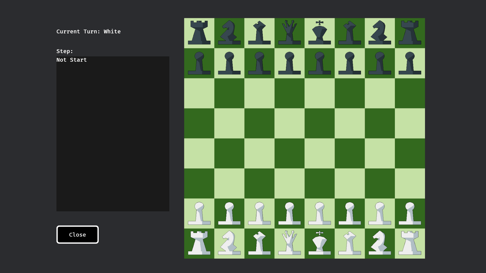

+++
title = "Chess TWO"
date = 2024-08-07
updated = 2025-08-19
description = "Continued optimization!"
taxonomies = { tags = ["learning", "practice"] }
+++

> **🤖 AI Translation Notice**: This post has been translated from Chinese to English by an AI.

# A Fresh Start!

Perhaps now is the perfect opportunity for a fresh start.

# Updating `Bevy`

First, let's update Bevy to v0.16.0!

There are two main changes:

1. Update the resource loading approach.
2. Update how `Camera2D` entities are added.

# Bug Fixes

When it's not your turn, left-clicking to select and right-clicking to move would trigger a capture effect if the target position had a piece.

This can be fixed by modifying just a small portion of the `move_pieces_system` in `system.rs`:

```rust
if let Some(select_color) = select_color {
    for (_pieces, position, mut color) in &mut query {
        if position.row == move_position.row && position.col == move_position.col {
            if color.kind == select_color {
                game_state.move_position = None;
                return;
            } else {
                // Check current turn before removing the piece.
                if color.kind != game_state.current_turn {
                    color.kind = ChessColorKind::Gray;
                }
            }
        }
    }
}
```

# UI

As planned, let's add some UI first. Bevy's UI structure consists of a `Node` plus UI elements.

Let's start by adding three UI elements: Turn, Steps, and Controls.

## Turn

Just a line of text. The UI entity consists of a `Name` component for identification, a `Node` component, and a `Text` component:

```rust
commands.spawn((
    Name::new("ui_turn"),
    Text::new("Current Turn: White"), // default White first
    Node {
        top: Val::Px(100.0),
        left: Val::Px(200.0),
        ..Default::default()
    },
));
```

## Steps

Similar to Turn, but with a `BackgroundColor` component for a background color, and some scroll controls (not yet usable).

Each step will be a child node, so all steps are rendered within the black background and arranged in the specified order.

Same logic as frontend development:

```rust
commands.spawn((
    Name::new("ui_steps"),
    Node {
        flex_direction: FlexDirection::Column,
        justify_content: JustifyContent::Start,
        align_items: AlignItems::Start,
        align_self: AlignSelf::Stretch,
        overflow: Overflow::scroll(),
        width: Val::Px(400.0),
        height: Val::Px(550.0),
        left: Val::Px(200.0),
        top: Val::Px(200.0),
        ..Default::default()
    },
    BackgroundColor(Color::srgb(0.1, 0.1, 0.1)),
    children![(
        Node {
            min_height: Val::Px(22.0),
            max_height: Val::Px(22.0),
            ..default()
        },
        children![(
            Text(format!("Not Start")),
            Label,
            AccessibilityNode(Accessible::new(Role::ListItem)),
        ),],
    ),],
));
```

## Controls

Add a close button. The button has borders, rounded corners, and text — again using child node logic to place the text inside the button:

```rust
commands.spawn((
    Name::new("close_button"),
    Button,
    Node {
        width: Val::Px(150.0),
        height: Val::Px(65.0),
        left: Val::Px(200.0),
        top: Val::Px(800.0),
        border: UiRect::all(Val::Px(5.0)),
        // horizontally center child text
        justify_content: JustifyContent::Center,
        // vertically center child text
        align_items: AlignItems::Center,
        ..default()
    },
    BorderColor(Color::WHITE),
    BorderRadius::all(Val::Px(10.0)),
    BackgroundColor(Color::BLACK),
    children![(
        Text::new("Close"),
        TextColor(Color::srgb(0.9, 0.9, 0.9)),
        TextShadow::default(),
    )],
));
```

## Result

And there we have it — a simple UI!


