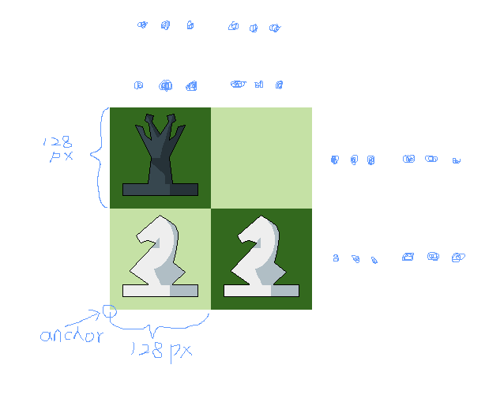
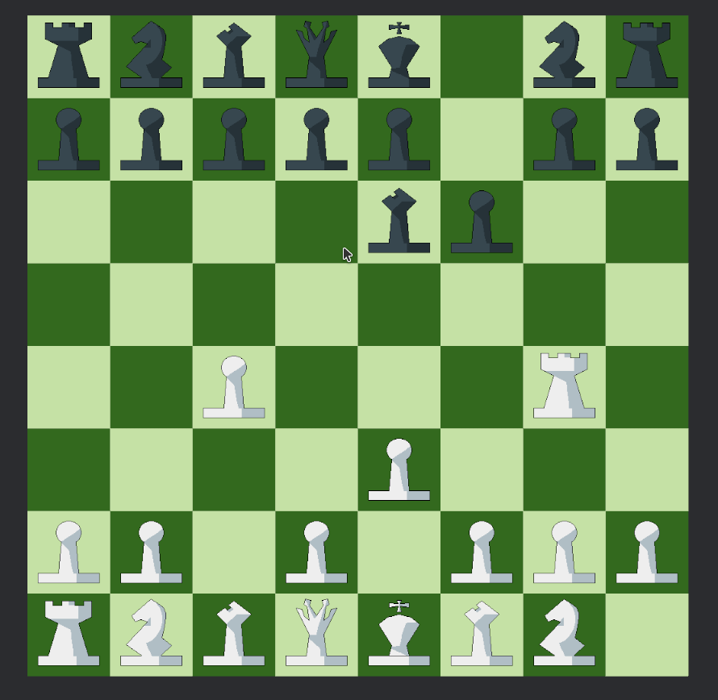

+++
title = "国际象棋 ONE"
date = 2024-04-20
updated = 2024-08-07
description = "以国际象棋为例学习编写游戏的第一节课吧！"

[taxonomies]
tags = ["学习", "实践"]
+++

# 缘由

万事开头难，作为完全新手的我，面对Bevy和ECS有些一筹莫展，此时便需有一个练手的试验项目了，相比直接开始一个大的项目，先从一个小的开始要现实得多，或许也是为什么当前（2024年4月）我的效率底下的原因吧。国际象棋是一个不错的选择，从建立GitHub仓库开始吧：[chess](https://github.com/DeadPoetSpoon/chess.git)。

# 本文基于

[chess v0.2.0](https://github.com/DeadPoetSpoon/chess/tree/v0.2.0)

# 创建工程

按照[官方教程](https://bevyengine.org/learn/quick-start/getting-started/setup/)

创建Rust工程
```bash
cargo new chess
cd chess
```

添加Bevy依赖
```bash
cargo add bevy
```

完成教程后面必要的配置
- [Compile with Performance Optimizations](https://bevyengine.org/learn/quick-start/getting-started/setup/#compile-with-performance-optimizations)
- [Enable Fast Compiles (Optional)](https://bevyengine.org/learn/quick-start/getting-started/setup/#enable-fast-compiles-optional)
- [Improve Runtime Performance (Optional)](https://bevyengine.org/learn/quick-start/getting-started/setup/#improve-runtime-performance-optional)

然后步入正题！

# 把游戏变为插件

> One of Bevy's core principles is modularity. All Bevy engine features are implemented as plugins---collections of code that modify an App. This includes internal features like the renderer, but games themselves are also implemented as plugins! This empowers developers to pick and choose which features they want. Don't need a UI? Don't register the UiPlugin. Want to build a headless server? Don't register the RenderPlugin. -- [Bevy](https://bevyengine.org/learn/quick-start/getting-started/plugins/)

按照官方的推荐，Bevy将一切组件均当作插件对待，也将我们的游戏作为插件组织吧！

创建chess文件夹及mod.rs文件

```rust
pub struct ChessPlugin {}

impl Plugin for ChessPlugin {
    fn build(&self, app: &mut bevy::prelude::App) {
    }
}
```

修改main.rs文件，引入我们的chess Mod，并将他添加至App的插件中

```rust
mod chess;

fn main() {
    App::new()
        .add_plugins(DefaultPlugins.set(bevy::log::LogPlugin::default()))
        .add_plugins(ChessPlugin {})
        .run();
}
```

# 思考国际象棋最基础的ECS

> All app logic in Bevy uses the Entity Component System paradigm, which is often shortened to ECS. ECS is a software pattern that involves breaking your program up into Entities, Components, and Systems. Entities are unique "things" that are assigned groups of Components, which are then processed using Systems. -- [Bevy](https://bevyengine.org/learn/quick-start/getting-started/ecs/)

## 实体（Entity）

- 棋子（PiecesEntity）：我们要玩的东西
- 棋盘（BoardEntity）：我们要玩的地方

## 组件（Component）

- 棋子（Pieces）：棋子实体的组件
- 棋盘（Board）：棋盘实体的组件
- 颜色（ChessColor）：只有黑白的国际象棋世界
- 位置（Position）：棋子与棋盘的位置
- 主题（Theme）：给棋子和棋盘换装
- 描述（Description）：留下一些话和帮助吧

## 系统（System）

- 鼠标事件监听系统（move_mouse_events_system）：监听鼠标的点击事件
- 初始化系统（startup_system）：完成游戏状态的初始化、创建棋盘等
- 棋子位置初始化系统（create_pieces_system）：按照默认位置生成棋子
- 棋盘渲染系统（show_board_system）：渲染棋盘
- 棋子渲染系统（show_pieces_system）：渲染棋子
- 棋子选择系统（select_pieces_system）：选择棋子
- 棋子移动系统（move_pieces_system）：移动棋子

## 资源（Resource）

- 当前的游戏状态(GameState)

## 资产（Asset）

- 棋子的初始位置与基本信息（PiecesInfos）
- 游戏设置(GameSetting)

# 来实现他们吧

## 创建实体与组件

创建 `component.rs` 与 `entity.rs` 文件，并在 `mod.rs` 文件中添加声明：

```rust
mod component;
mod entity;
```

### 棋子与棋盘

两者需棋子组件与棋盘组件进行区分

```rust
// 棋子实体
// 添加Bundle、Default默认实现
#[derive(Bundle, Default)]
pub struct PiecesEntity {
    pub pieces: Pieces,
}

// 棋盘实体
// 添加Bundle、Default默认实现
#[derive(Bundle, Default)]
pub struct BoardEntity {
    pub board: Board,
}

```

两者需要有游戏进行的必要通用组件，这些需要我们自己实现

```rust
// 代表棋子或棋盘的颜色
pub color: ChessColor,
// 代表棋子或棋盘的描述信息
pub des: Description,
// 代表棋子或棋盘的位置
pub position: Position,
// 代表棋子或棋盘的皮肤
pub theme: Theme,
```

还需要有进行渲染的基本组件，这些为Bevy现有组件，其实就是[SpriteBundle](https://docs.rs/bevy/latest/bevy/sprite/struct.SpriteBundle.html)

```rust
// 设置Sprite渲染属性
pub sprite: Sprite,
// 相对父的Transform
pub transform: Transform,
// 绝对Transform
pub global_transform: GlobalTransform,
// 一个指向待渲染图片资产的引用计数“指针”
pub texture: Handle<Image>,
// 控制是否渲染
pub visibility: Visibility,
// 继承的可见性
pub inherited_visibility: InheritedVisibility,
// 可视性
pub view_visibility: ViewVisibility,
```
最终的 `entity.rs` : <https://github.com/DeadPoetSpoon/chess/blob/v0.2.0/src/chess/entity.rs>


### 组件

#### 添加 `serde`

因为部分组件结构体需要同时支持从文件中反序列化，因此添加 `serde` 依赖
```bash
cargo add serde --features serde_derive
```

#### 描述信息

```rust
// 添加默认实现
#[derive(Component, Default, Clone, Serialize, Deserialize)]
pub struct Description {
    // 名称
    pub name: String,
    // 描述
    pub des: String,
    // 帮助
    pub help: String,
}
```

#### 颜色

需要 `struct` 作为组件，而需要 `enum` 去表示颜色

```rust
// 添加默认实现
#[derive(Default, Debug, Clone, Serialize, Deserialize, PartialEq)]
pub enum ChessColorKind {
    // 白
    #[default]
    White,
    // 黑
    Black,
    // 灰：那些被“吃”掉的棋子
    Gray,
}

// 实现`Display`
impl Display for ChessColorKind {
    fn fmt(&self, f: &mut std::fmt::Formatter<'_>) -> std::fmt::Result {
        match self {
            ChessColorKind::White => f.write_str("white"),
            ChessColorKind::Black => f.write_str("black"),
            ChessColorKind::Gray => f.write_str("gray"),
        }
    }
}

//添加默认实现
#[derive(Component, Default)]
pub struct ChessColor {
    // 颜色
    pub kind: ChessColorKind,
}
```

#### 位置

棋子和棋盘的位置只能为8*8的方格中，因此使用 `u8` 存储

```rust
// 添加默认实现
#[derive(Component, Default, Debug, PartialEq, Clone)]
pub struct Position {
    // 行 [0,7]
    pub row: u8,
    // 列 [0,7]
    pub col: u8,
}
```

#### 皮肤

本质是使用不同文件夹下的图片

```rust
// 添加默认实现
#[derive(Component, Default)]
pub struct Theme {
    // 图片位置
    pub asset_father_path: String,
}
```

#### 棋子

包含棋子类别的枚举与其是否被选中属性

```rust
// 添加默认实现
#[derive(Default, Debug, Clone, Serialize, Deserialize)]
pub enum PiecesKind {
    #[default]
    King,
    Queen,
    Rook,
    Knight,
    Bishop,
    Pawn,
}

// 实现Display
impl Display for PiecesKind {
    fn fmt(&self, f: &mut std::fmt::Formatter<'_>) -> std::fmt::Result {
        match self {
            PiecesKind::King => f.write_str("king"),
            PiecesKind::Queen => f.write_str("queen"),
            PiecesKind::Rook => f.write_str("rook"),
            PiecesKind::Knight => f.write_str("knight"),
            PiecesKind::Bishop => f.write_str("bishop"),
            PiecesKind::Pawn => f.write_str("pawn"),
        }
    }
}

// 添加默认实现
#[derive(Component, Default, Debug)]
pub struct Pieces {
    // 棋子类别
    pub kind: PiecesKind,
    // 是否被选中
    pub selected: bool,
}
```

#### 棋盘

棋盘当前什么也没有

```rust
// 添加默认实现
#[derive(Component, Default)]
pub struct Board {}
```

#### 完成

最终的 `component.rs` : <https://github.com/DeadPoetSpoon/chess/blob/v0.2.0/src/chess/component.rs>

## 创建资源

创建 `resource.rs` 文件，并在 `mod.rs` 文件中添加声明：

```rust
mod resource;
```

目前仅有的资源为游戏的状态

首先需要记录当前执棋颜色、选中的棋子、将移动的位置

```rust
#[derive(Resource, Default, Debug)]
pub struct GameState {
    // 先记录选择的位置
    pub selected_position: Option<Position>,
    // 先记录将移动至的位置
    pub move_position: Option<Position>,
    // 当前执棋颜色
    pub current_turn: ChessColorKind,
}
```

需加上对游戏设置、棋子初始位置资产的控制

```rust
// 游戏设置
pub game_setting_handle: Handle<GameSetting>,
pub game_setting_has_load: bool,
// 棋子初始位置及基本信息
pub pieces_infos_handle: Handle<PiecesInfos>,
pub pieces_infos_has_load: bool,
```

最终的 `resource.rs` : <https://github.com/DeadPoetSpoon/chess/blob/v0.2.0/src/chess/resource.rs>

## 创建资产

创建 `asset.rs`  文件，并在 `mod.rs` 文件中添加声明：

```rust
mod asset;
```

### 处理资产读取错误

按照[官方教程](https://github.com/bevyengine/bevy/blob/main/examples/asset/custom_asset.rs)方式加载自定义资产，先处理错误

```rust
#[derive(Debug, Error)]
pub enum AssetLoaderError {
    #[error(transparent)]
    Io(#[from] std::io::Error),
    #[error(transparent)]
    RonError(#[from] ron::error::Error),
    #[error(transparent)]
    RonSpannedError(#[from] ron::error::SpannedError),
    #[error(transparent)]
    LoadDirectError(#[from] bevy::asset::LoadDirectError),
}
```

### 游戏设置
目前为空

```rust
#[derive(Asset, TypePath, Default, Serialize, Deserialize)]
pub struct GameSetting {}
```

实现自定义资产加载器，拓展名设置为 `setting.ron`

```rust
#[derive(Default)]
pub struct GameSettingLoader;

impl AssetLoader for GameSettingLoader {
    type Asset = GameSetting;

    type Settings = ();

    type Error = AssetLoaderError;

    fn load<'a>(
        &'a self,
        reader: &'a mut Reader,
        _settings: &'a Self::Settings,
        _load_context: &'a mut LoadContext,
    ) -> BoxedFuture<'a, Result<Self::Asset, Self::Error>> {
        Box::pin(async move {
            let mut bytes = Vec::new();
            reader.read_to_end(&mut bytes).await?;
            let ron = ron::de::from_bytes(&bytes)?;
            Ok(ron)
        })
    }
    fn extensions(&self) -> &[&str] {
        &["setting.ron"]
    }
}
```

### 棋子的初始位置与基本信息

加载各个棋子的初始位置、描述信息等，需要一个列表存储所有棋子的信息

```rust
#[derive(Asset, TypePath, Default, Serialize, Deserialize)]
pub struct PiecesInfos {
    pub pieces_info_vec: Vec<PiecesInfo>,
}

#[derive(Default, Serialize, Deserialize)]
pub struct PiecesInfo {
    pub des: Description,
    pub color: ChessColorKind,
    pub kind: PiecesKind,
    pub row: u8,
    pub col: u8,
    pub theme: String,
}

```

实现自定义资产加载器，拓展名设置为 `pieces.ron`

```rust
#[derive(Default)]
pub struct PiecesInfosLoader;

impl AssetLoader for PiecesInfosLoader {
    type Asset = PiecesInfos;
    type Settings = ();
    type Error = AssetLoaderError;

    fn load<'a>(
        &'a self,
        reader: &'a mut Reader,
        _settings: &'a Self::Settings,
        _load_context: &'a mut LoadContext,
    ) -> BoxedFuture<'a, Result<Self::Asset, Self::Error>> {
        Box::pin(async move {
            let mut bytes = Vec::new();
            reader.read_to_end(&mut bytes).await?;
            let ron = ron::de::from_bytes(&bytes)?;
            Ok(ron)
        })
    }

    fn extensions(&self) -> &[&str] {
        &["pieces.ron"]
    }
}
```

### 完成

最终的 `asset.rs` : <https://github.com/DeadPoetSpoon/chess/blob/v0.2.0/src/chess/asset.rs>

默认的棋子信息 `default.pieces.ron` : <https://github.com/DeadPoetSpoon/chess/blob/v0.2.0/assets/default.pieces.ron>

## 系统

终于来到系统部分了，思考我们要“如何去下棋！”

创建 `event.rs` 与 `system.rs` 文件，并在 `mod.rs` 文件中添加声明：

```rust
mod event;
mod system;
```

### 事件

下棋的动作可以拆解为两步，选择需要移动的棋子和选择要移过去的位置，我们可以使用鼠标的左右键去实现

当左键点击时，记录点击的棋盘位置，标记为选中棋子；当右键点击时，记录点击的棋盘位置，标记为移动位置

参照[官方教程](https://github.com/bevyengine/bevy/blob/main/examples/input/mouse_input.rs)

```rust
pub fn move_mouse_events_system(
    mouse_button_input: Res<ButtonInput<MouseButton>>,
    window: Query<&Window, With<PrimaryWindow>>,
    camera: Query<(&Camera, &GlobalTransform)>,
    mut game_state: ResMut<GameState>,
) {
    // 左键点击时
    if mouse_button_input.just_released(MouseButton::Left) {
        // 获取当前窗口
        if let Some(window) = window.iter().next() {
            // 获取鼠标位置
            if let Some(mouse_position) = window.cursor_position() {
                // 获取相机转换参数
                let (camera, camera_transform) = camera.single();
                if let Some(mouse_position) =
                    // 转换鼠标点击位置至世界坐标
                    camera.viewport_to_world_2d(camera_transform, mouse_position)
                {
                    // 计算棋盘坐标
                    let row = (mouse_position.y as i32 / 128) as u8;
                    let col = (mouse_position.x as i32 / 128) as u8;
                    // 保存选择位置至游戏状态中
                    if game_state.selected_position.is_none() {
                        game_state.selected_position = Some(Position { row, col });
                    } else {
                        let position = game_state.selected_position.as_mut().unwrap();
                        position.col = col;
                        position.row = row;
                    }
                }
            }
        }
    }

    if mouse_button_input.just_released(MouseButton::Right) {
        if let Some(window) = window.iter().next() {
            if let Some(mouse_position) = window.cursor_position() {
                let (camera, camera_transform) = camera.single();
                if let Some(mouse_position) =
                    camera.viewport_to_world_2d(camera_transform, mouse_position)
                {
                    let row = (mouse_position.y as i32 / 128) as u8;
                    let col = (mouse_position.x as i32 / 128) as u8;
                    // 保存选择的移动位置至游戏状态中
                    if game_state.move_position.is_none() {
                        game_state.move_position = Some(Position { row, col })
                    } else {
                        let position = game_state.move_position.as_mut().unwrap();
                        position.col = col;
                        position.row = row;
                    }
                }
            }
        }
    }
}
```

最终的 `event.rs` : <https://github.com/DeadPoetSpoon/chess/blob/v0.2.0/src/chess/event.rs>

### 初始化系统

该系统完成2d相机的初始化、游戏状态的初始化、棋盘的初始化

```rust
pub fn startup_system(
    mut commands: Commands,
    mut game_state: ResMut<GameState>,
    assets: Res<AssetServer>,
) {
    // 创建相机
    commands.spawn(Camera2dBundle {
        // 相机基本位置
        transform: Transform::from_translation(Vec3 {
            x: 450.0,
            y: 450.0,
            z: 0.0,
        }),
        // 相机缩放尺寸
        projection: OrthographicProjection {
            scaling_mode: ScalingMode::WindowSize(0.8f32),
            near: -1000.0,
            far: 1000.0,
            ..Default::default()
        },
        ..Default::default()
    });
    // 游戏状态初始化，与资源加载
    game_state.game_setting_handle = assets.load("default.setting.ron");
    game_state.game_setting_has_load = true;
    game_state.pieces_infos_handle = assets.load("default.pieces.ron");
    game_state.current_turn = ChessColorKind::White;
    // 创建棋盘
    commands.spawn_batch(create_board_bundles());
}
```

循环行列创建棋盘

```rust
pub fn create_board_bundles() -> Vec<BoardEntity> {
    let mut bundles = Vec::new();
    // 颜色循环标记
    let mut flag = true;
    for row in 0..8 {
        for col in 0..8 {
            bundles.push(BoardEntity {
                board: Board {},
                color: ChessColor {
                    kind: match flag {
                        true => ChessColorKind::Black,
                        false => ChessColorKind::White,
                    },
                },
                des: Description {
                    name: format!("{}_{}", row, col),
                    des: "board".to_string(),
                    help: "board".to_string(),
                },
                position: Position { row, col },
                theme: Theme {
                    asset_father_path: "default".to_string(),
                },
                sprite: Sprite {
                    anchor: Anchor::BottomLeft,
                    ..Default::default()
                },
                ..Default::default()
            });
            flag = !flag;
        }
        flag = !flag;
    }
    bundles
}
```

### 棋子位置初始化系统

将其单独作为一个系统是期望实现游戏过程中重新归位所有棋子

读取棋子的初始位置与基本信息（PiecesInfos）创建所有棋子

```rust
pub fn create_pieces_system(
    mut commands: Commands,
    mut game_state: ResMut<GameState>,
    infos: Res<Assets<PiecesInfos>>,
) {
    // 不重复加载
    if game_state.pieces_infos_has_load {
        return;
    }
    // 加载棋子信息
    let pieces_infos_option = infos.get(&game_state.pieces_infos_handle);

    // 确保成功加载
    if pieces_infos_option.is_none() {
        return;
    }

    let pieces_infos = pieces_infos_option.unwrap();

    let mut bundles = Vec::new();
    // 循环创建棋子
    for info in &pieces_infos.pieces_info_vec {
        bundles.push(PiecesEntity {
            pieces: Pieces {
                kind: info.kind.clone(),
                ..Default::default()
            },
            color: ChessColor {
                kind: info.color.clone(),
            },
            des: info.des.clone(),
            position: Position {
                row: info.row,
                col: info.col,
            },
            theme: Theme {
                asset_father_path: info.theme.clone(),
            },
            sprite: Sprite {
                anchor: Anchor::BottomLeft,
                ..Default::default()
            },
            ..Default::default()
        });
    }
    // 创建棋子实体
    commands.spawn_batch(bundles);
    game_state.pieces_infos_has_load = true;
}
```

### 棋盘渲染系统

设定好贴图与位置就可以显示棋盘与棋子

当前规定贴图大小为 `128px` ，并将贴图的锚点设置为左下角，因此行列位置乘以128便为其在世界坐标的位置

按照 `主题/颜色/名称.png` 的结构加载贴图资源

```rust
pub fn show_board_system(
    mut query: Query<(
        &Board,
        &ChessColor,
        &Theme,
        &Position,
        &mut Transform,
        &mut Handle<Image>,
    )>,
    asset_server: Res<AssetServer>,
) {
    for (_board, color, theme, position, mut transform, mut texture) in &mut query {
        transform.translation.x = position.col as f32 * 128.0;
        transform.translation.y = position.row as f32 * 128.0;
        *texture = asset_server.load(format!(
            "{}/{}/board.png",
            theme.asset_father_path, color.kind
        ));
    }
}
```

### 棋子渲染系统

与棋盘一样，但当棋子颜色设定为 `Gray` 时隐藏棋子

按照 `主题/颜色/棋子类别.png` 的结构加载贴图资源

```rust
pub fn show_pieces_system(
    mut query: Query<(
        &Pieces,
        &ChessColor,
        &Theme,
        &Position,
        &mut Transform,
        &mut Handle<Image>,
        &mut Visibility,
    )>,
    asset_server: Res<AssetServer>,
) {
    for (pieces, color, theme, position, mut transform, mut texture, mut visibility) in &mut query {
        if color.kind == ChessColorKind::Gray {
            *visibility = Visibility::Hidden;
        } else {
            transform.translation.x = position.col as f32 * 128.0;
            transform.translation.y = position.row as f32 * 128.0;
            *texture = asset_server.load(format!(
                "{}/{}/{}.png",
                theme.asset_father_path, color.kind, pieces.kind
            ));
        }
    }
}
```

### 棋子选择系统

在捕获鼠标点击事件后，只需设定与点击位置坐标相同的棋子为选中状态，其他棋子为非选中状态

```rust
pub fn select_pieces_system(
    mut query: Query<(&mut Pieces, &Position)>,
    game_state: ResMut<GameState>,
) {
    if let Some(selected_position) = game_state.selected_position.clone() {
        for (mut pieces, position) in &mut query {
            if selected_position == *position {
                pieces.selected = true;
            } else {
                pieces.selected = false;
            }
        }
    }
}
```

### 棋子移动系统

棋子移动需要考虑以下情况

1. 在棋子移动前需确认棋子颜色与当前回合是否一致
1. 在棋子移动前需确认棋子移动至的位置是否有其他棋子，若有相同颜色棋子则无法移动；若有不同颜色棋子则吃掉那颗棋子
1. 完成移动后需要切换回合

```rust
pub fn move_pieces_system(
    mut query: Query<(&mut Pieces, &mut Position, &mut ChessColor)>,
    mut game_state: ResMut<GameState>,
) {
    // 判断是否需要进行移动操作
    if let Some(move_position) = game_state.move_position.clone() {
        // 获取选中棋子的颜色
        let mut select_color = None;
        for (pieces, _position, color) in &mut query {
            if pieces.selected {
                select_color = Some(color.kind.clone());
            }
        }
        if let Some(select_color) = select_color {
            for (_pieces, position, mut color) in &mut query {
                if position.row == move_position.row && position.col == move_position.col {
                    if color.kind == select_color {
                        // 移动位置有相同颜色棋子，则无法移动
                        game_state.move_position = None;
                        return;
                    } else {
                        // 移动位置有不同颜色棋子，则被吃掉
                        color.kind = ChessColorKind::Gray;
                    }
                }
            }
        }
        for (mut pieces, mut position, color) in &mut query {
            // 移动棋子颜色与当前回合一致时移动
            if pieces.selected && color.kind == game_state.current_turn {
                position.row = move_position.row;
                position.col = move_position.col;
                pieces.selected = false;
                // 移动完成后切换游戏回合
                if game_state.current_turn == ChessColorKind::White {
                    game_state.current_turn = ChessColorKind::Black;
                } else {
                    if game_state.current_turn == ChessColorKind::Black {
                        game_state.current_turn = ChessColorKind::White;
                    }
                }
            }
        }
        game_state.move_position = None;
    }
}
```

### 完成

最终的 `system.rs` : <https://github.com/DeadPoetSpoon/chess/blob/v0.2.0/src/chess/system.rs>

## 贴图

### Aseprite
使用 [Aseprite](https://aseprite.org/) 创建贴图，感谢 [lichess.org](https://lichess.org/)

### 棋盘


### 棋子


### 渲染情况




## 运行起来把！

```bash
cargo r
```



# 下一步计划

- [   ] 完成简单的 UI
- [   ] 限制每个棋子的走法
- [   ] 添加游戏获胜条件
- [   ] 添加一些音乐和音效
- [   ] 参加一些开源项目
- [   ] 学习 GITHUB 项目开发基本规范

[下一篇： 国际象棋 TWO](../two)
