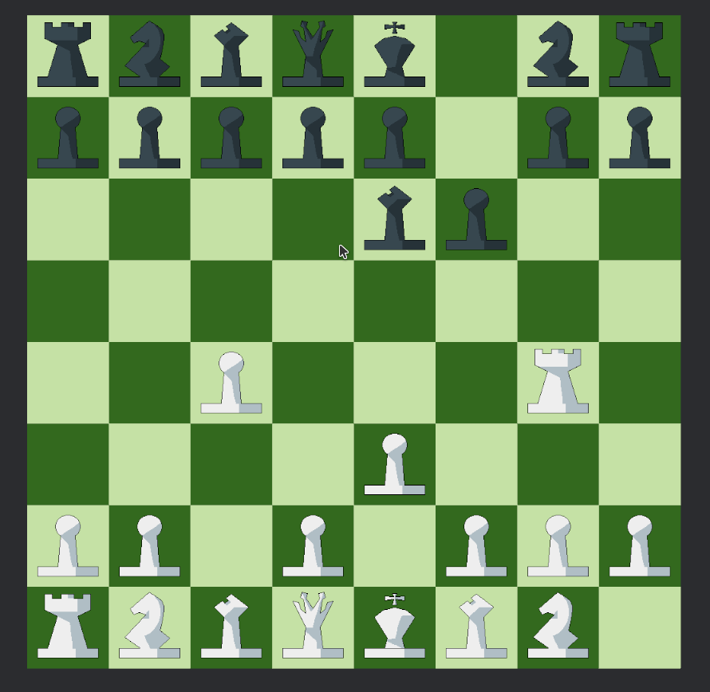

+++
title = "Chess"
description = "A learning project: chess written in Rust."
weight = 10

[extra]
local_image = "projects/chess/knight.webp"
+++

# Chess

[Chess](https://github.com/DeadPoetSpoon/chess): A learning project — chess written in Rust.

# Game

